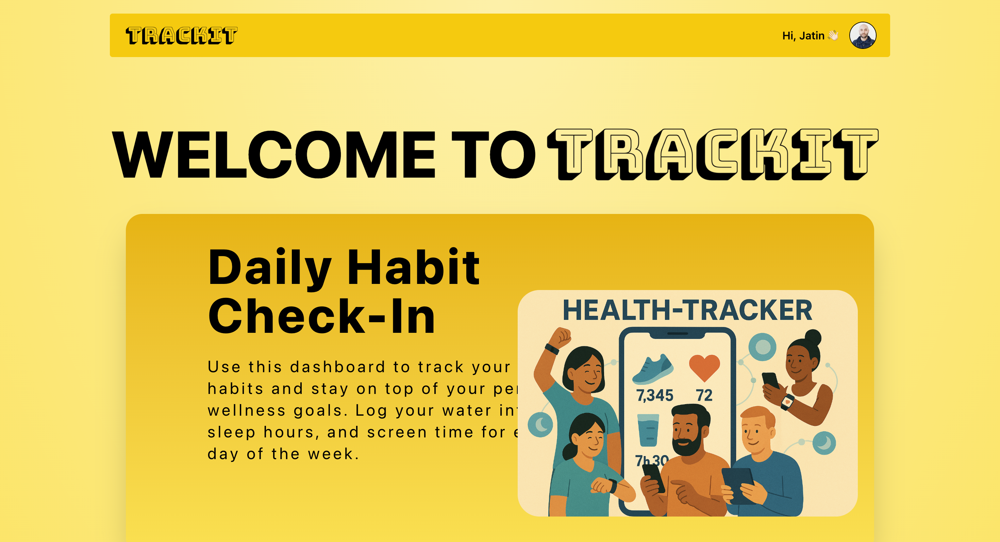

<h1 align="center">🧭 Tracker App</h1>

<p align="center">A habit tracking web application built using <strong>Next.js, TypeScript, Tailwind CSS, and Vercel</strong>. This app helps users visually manage their daily habits like water intake, sleep, and screen time.
  <br />
  <a href="https://tracker-six-gilt.vercel.app"><strong>🔗 Live Demo</strong></a> |
  <a href="https://github.com/JatinMehta007/tracker"><strong>🧠 Source Code</strong></a>
</p>

<p align="center">
  
  
  
</p>

---

## 📸 Preview

 
---
## 🚀 Features

- 📅 Select specific dates to view or edit habit data.
- 🧪 Track habits such as water intake, sleep, and screen usage.
- 💾 Data persistence using in-memory — easily extendable to a backend.
- ⚡ Fast and responsive UI with Tailwind CSS.
- 🌐 Deployed on Vercel.

---

## 🛠️ Tech Stack

- [Next.js 15](https://nextjs.org/)
- [TypeScript](https://www.typescriptlang.org/)
- [Tailwind CSS](https://tailwindcss.com/)
- [Vercel](https://vercel.com)

---

## 📦 Installation

```bash
git clone https://github.com/JatinMehta007/tracker.git
cd tracker
npm install
npm run dev
